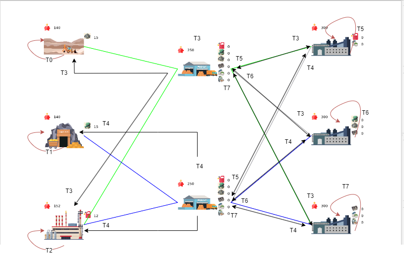

# Rapport du labo 3 PCO : Factory

#### Auteurs : Rafael Dousse et Massimo Stefani

## Description de l'implémentation

Dans ce laboratoire, l'objectif est de simuler des chaînes de production de robots, depuis la matière première jusqu'au produit final. Pour ce faire, il était possible d'effectuer ce laboratoire en utilisant simplement de la programmation séquentielle. Cependant, cela ne représente pas fidèlement la réalité du monde industriel. En effet, dans le monde industriel, de multiples acteurs travaillent en parallèle et sont interconnectés par le biais d'achats et de ventes. C'est pourquoi nous avons opté pour l'utilisation de la programmation concurrente dans le cadre de ce laboratoire. Nous avons ainsi utilisé des threads pour simuler les différentes entités qui travaillent simultanément. Pour ce faire, nous avons exploité la classe `PcoThread`, qui nous permet de créer et de gérer ces threads de manière efficace.

## Architecture du programme

### Seller

Dans le cadre de notre simulation, nous avons créé une classe Seller qui sert de classe abstraite, héritée par les classes `Extractor`, `Factory`, et `Wholeseller`. Ces classes représentent les différents acteurs travaillant simultanément dans notre scénario. Chaque thread est associé à une instance unique de l'une de ces classes. Pour mettre en œuvre cette simultanéité, nous avons implémenté la méthode `run()`, qui est appelée lorsqu'un thread est lancé. Chacune de ces classes possède son propre comportement spécifique dans la fonction `run()`.

Afin de garantir la cohérence et l'intégrité des données partagées entre les threads, nous avons pris la décision judicieuse d'utiliser un Mutex. En effet, il est possible que plusieurs threads tentent d'accéder à la même variable simultanément, ce qui peut entraîner des incohérences dans les données. Nous avons donc introduit un Mutex pour protéger les sections critiques de nos fonctions. Notamment, les variables `stocks` et `money` étaient particulièrement sensibles, car elles sont étroitement liées dans notre simulation. Tout changement apporté à l'une de ces variables doit être suivi d'une mise à jour de l'autre pour maintenir la cohérence du modèle.

Dans ce contexte, nous avons opté pour l'utilisation d'un seul Mutex pour protéger ces variables. L'avantage de cette approche est de simplifier la gestion des accès concurrents aux données. Cependant, il est important de noter que d'autres scénarios pourraient nécessiter l'utilisation de plusieurs Mutex, permettant ainsi à plusieurs threads d'accéder simultanément à des variables différentes sans se bloquer mutuellement.

### Flux de threads
Pour une meilleure compréhension du fonctionnement de notre programme, voici un schéma qui représente les différents threads et les "flux" qu'ils empruntent.



### Extractor
La principale mission de cette entité est d'extraire des ressources telles que le cuivre, le sable ou le pétrole. Elle accomplit cette tâche en utilisant la fonction `run()` uniquement lorsque l'extracteur dispose d'assez d'argent pour rémunérer les mineurs. Le thread associé à cette classe fonctionne dans une boucle `while`, ce qui permet à l'extracteur de continuer son activité d'extraction sans perturber les opérations des autres entités. Cependant, l'extracteur possède également la méthode `trade()`, qui lui permet de vendre les ressources extraites à un acheteur particulier. Lorsque cette méthode est exécutée, le thread en charge de son exécution interagit avec les variables `money` et `stocks` de l'extracteur. Par conséquent, il est impératif de protéger ces variables en utilisant un mutex

### Wholeseller
L'objectif principal de cette entité est d'acheter diverses ressources telles que le cuivre, le sable, le pétrole, les puces électroniques, le plastique ou les robots. Cette opération est réalisée grâce à la fonction `run()`, qui à son tour appelle la fonction `buyResources()`. La fonction `buyResources()` prend une décision aléatoire pour choisir une ressource spécifique et achète une quantité déterminée de cette ressource auprès d'un fournisseur particulier. Lorsque cette fonction est exécutée, le thread associé à cette classe interagit avec les variables `money` et `stocks` des autres entités, car il effectue des transactions en appelant la fonction `trade()` de chaque entité impliquée dans la vente.

De plus, cette classe dispose également de sa propre fonction `trade()`, qui lui permet de vendre les ressources acquises à une usine (`Factory`). Dans ce cas, elle modifie les variables `money` et `stocks`. Il est donc essentiel de protéger ces variables avec un mutex pour éviter les problèmes de concurrence.

### Factory
La principale mission de cette entité est de fabriquer des puces électroniques, du plastique ou des robots en utilisant les ressources qu'elle peut acheter auprès des grossistes (Wholesellers). Pour atteindre cet objectif, la fonction `run()` de l'usine appelle la fonction `buildItem()`, qui déclenche le processus de fabrication si l'usine dispose des ressources nécessaires en stock. Dans le cas contraire, l'usine achète les ressources manquantes aux grossistes pour pouvoir continuer la production. Lorsque cette fonction est exécutée, le thread associé à cette classe interagit avec les variables `money` et `stocks` des grossistes, car il effectue des transactions en appelant la fonction `trade()` de chaque entité grossiste impliquée dans la vente des ressources nécessaires.

De plus, cette classe possède également sa propre fonction `trade()`, qui lui permet de vendre les produits manufacturés aux grossistes. Dans ce cas, elle modifie les variables `money` et `stocks` des grossistes. Il est donc essentiel de protéger ces variables avec un mutex pour éviter tout problème de concurrence lors de ces transactions.

### Choix d'implémentation
Comme nous l'avons expliqué précédemment, notre choix d'utiliser un seul mutex était délibéré. En effet, les variables à protéger, en l'occurrence `money` et `stocks`, sont fortement interdépendantes. Cette approche simplifie considérablement le code et améliore sa lisibilité. De plus, elle élimine le risque d'oublier de protéger une variable, car un seul mutex est nécessaire pour toutes les opérations de protection.

Cependant, cette solution présente des avantages et des inconvénients. Un inconvénient majeur est le risque de verrouillage mutuel ou "interblocage" entre les entités `Factory` et `Wholeseller`. Si la `Factory` essaie d'acheter chez un `Wholeseller` en même temps que ce dernier essaie d'acheter chez la `Factory`, les deux threads peuvent se bloquer mutuellement.

#### Interblocage
```c++
void Factory::orderResources() {
    for (auto resource : resourcesNeeded) {
        int price = getCostPerUnit(resource);
        if (stocks[resource] == 0) {
            for (auto wholesaler : wholesalers) {
                mutex.lock();
                if(wholesaler->getItemsForSale()[resource] > 0 && money >= price && wholesaler->trade(resource, 1) == price) {
                    money -= price;
                    stocks[resource] += 1;
                    mutex.unlock();
                }
                mutex.unlock();
            }
        }
    }
}
```

```c++
void Wholesale::buyResources() {
    // Code avant //
    mutex.lock();
    if (price <= money && (s->trade(i, qty) == price)) {
        stocks[i] += qty;
        money -= price;
        mutex.unlock();
        interface->consoleAppendText(uniqueId, QString("I bought %1 of ").arg(qty) %
                                     getItemName(i) % QString(" for %1").arg(price));
    }
    mutex.unlock();
}
```

Cependant, il est possible de résoudre ce problème de la manière suivante:

#### Non interblocage
```c++
void Factory::orderResources() {
    for (auto resource : resourcesNeeded) {
        int price = getCostPerUnit(resource);
        if (stocks[resource] == 0) {
            for (auto wholesaler : wholesalers) {
                if(wholesaler->getItemsForSale()[resource] > 0 && money >= price && wholesaler->trade(resource, 1) == price) {
                    mutex.lock();
                    money -= price;
                    stocks[resource] += 1;
                    mutex.unlock();
                }
            }
        }
    }

    //Temps de pause pour éviter trop de demande
    PcoThread::usleep(10 * 100000);

}
```

```c++
void Wholesale::buyResources() {
    // Code avant //
    if (price <= money && (s->trade(i, qty) == price)) {
        mutex.lock();
        stocks[i] += qty;
        money -= price;
        mutex.unlock();
        interface->consoleAppendText(uniqueId, QString("I bought %1 of ").arg(qty) %
                                     getItemName(i) % QString(" for %1").arg(price));
    }
}
```
Nous avons opté pour la 2ème solution car l'idée derrière cette approche est de tirer parti du fait que, après un `trade()`, les ressources du `Wholeseller` seront modifiées, mais son argent sera au moins le même, voire supérieur, car la seule méthode qui modifie l'argent est `trade()`, et elle n'effectue que des ajouts d'argent. Il est donc essentiel de prendre en compte cette logique si vous envisagez de modifier le code ultérieurement.


### Util
C'est dans ce fichier que toute les différents seller de notre programmes sont crées et terminés. Lorsqu'on clique sur la croix de la fenêtre pour arrêter les différents threads, on doit ajouter dans la fonction `endService()` ce bout de code:
```c++
    for(auto& thread : threads){
        thread->requestStop();
    }
```
Cette boucle for fait un requestStop aux thread et nous permet aussi d'utiliser un booléen dans le while des différentes fonction run() qui sont implémentées dans les `seller`. C'est donc cette condition `!PcoThread::thisThread()->stopRequested())` qui interrompt les boucles while et qui fait que nos threads s'arrêtent de travailler et que l'on peut quitter le programme sans erreur.

## Tests
Pour ce labo, il a été difficile de trouver de bons tests pour vérifier le fonctionnement de notre programme. Cependant, il est quand même possible de faire certains test "visuel". Nous avons par exemple enlever les mutex dans les fonctions et avons vu que < a tester et dire ce que ça fait, peut être ajouter des images>.
Les `Pco usleep` permet aux threads de prendre leur temps pour faire les transactions et construire les différents objets

- Test avec 1 extracteur, 1 usine et 1 grossiste et noter quelques transactions
- Test le temps d'attente à 100000 (Ils doivent rester sur sleep, pas de blocage mutuel)
